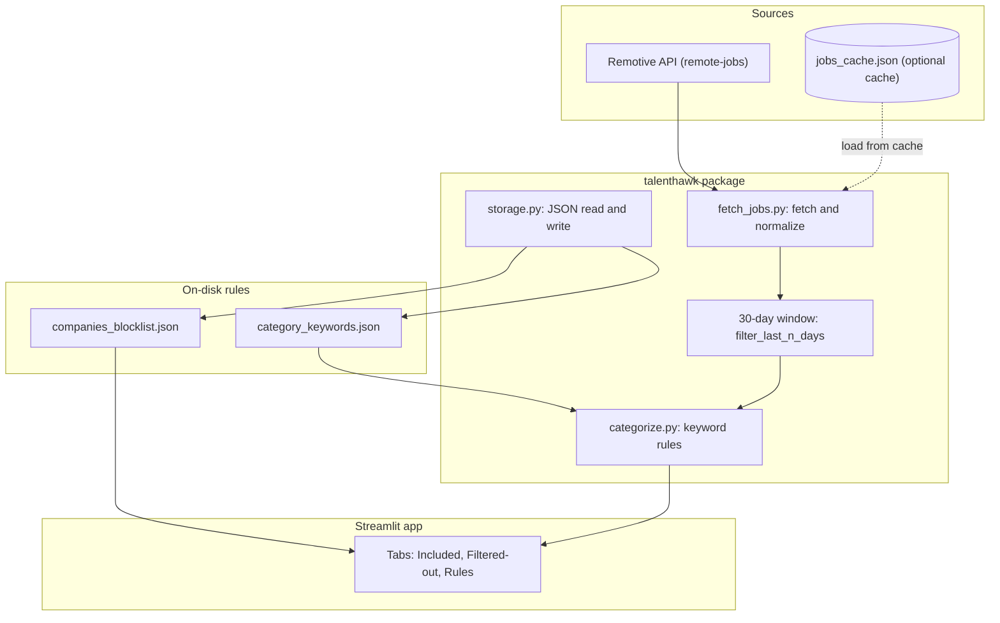

<div align="center">

# TalentHawk

**Local-first remote job intelligence** — ingest listings, apply your own category and company rules, and visualize what you keep versus what you filter out.

[](https://www.python.org/downloads/)
[](https://streamlit.io/)
[](https://docs.astral.sh/uv/)
[](https://github.com/awesomesince96/talenthawk/blob/main/LICENSE)
[](https://github.com/awesomesince96/talenthawk)

</div>

---

## Why this exists

Hiring pipelines are noisy: the same feed mixes roles you want with companies you would never apply to, and titles that need grouping before you can reason about volume. TalentHawk treats that as a **small data pipeline plus a decision UI**: fetch normalized rows, window by recency, classify titles with explicit rules, split on a blocklist, and surface **included vs. excluded** distributions so you can see *patterns*, not just a flat list.

---

## Table of contents

- [Features](#features)
- [Architecture](#architecture)
- [Quick start](#quick-start)
- [Project layout](#project-layout)
- [Persistence and configuration](#persistence-and-configuration)
- [Extending](#extending)
- [License](#license)

---

## Features

| Area | What you get |
|------|----------------|
| **Ingest** | Pulls from the public [Remotive remote jobs API](https://remotive.com/api/remote-jobs), normalizes to a single schema (`title`, `company`, `published_at`, `url`, `source`). |
| **Time window** | Keeps listings whose `published_at` falls in the **last 30 days** (UTC-aware parsing with fallbacks for odd date strings). |
| **Categories** | Ordered keyword rules: **first matching category wins**; otherwise **Other**. Editable in the app or in JSON on disk. |
| **Company blocklist** | Case-insensitive substring matching against company names; drives a separate **filtered-out** view and charts. |
| **Resilience** | Optional on-disk `jobs_cache.json` when the API is unreachable; load or refresh from the sidebar. |
| **Analytics** | [Plotly](https://plotly.com/python/) bar charts for category mix (included vs. excluded) and top blocked companies by volume. |

---

## Architecture

High-level flow from source to UI:



**Separation of concerns:** fetching and date filtering live in `fetch_jobs.py`, classification is pure logic in `categorize.py`, persistence is isolated in `storage.py`, and `streamlit_app.py` orchestrates session state, metrics, and charts.

---

## Quick start

**Prerequisites:** [Python 3.11+](https://www.python.org/downloads/) and [uv](https://docs.astral.sh/uv/getting-started/installation/).

```bash
git clone https://github.com/awesomesince96/talenthawk.git
cd talenthawk
uv sync
uv run streamlit run streamlit_app.py
```

- `uv sync` creates `.venv`, installs dependencies from `pyproject.toml` / `uv.lock`, and installs this package in **editable** mode so `import talenthawk` works inside the app.
- The browser UI opens locally. First load fetches from Remotive; use **Load from saved cache** if you are offline and have cached data.

---

## Project layout

```
talenthawk/
├── streamlit_app.py          # Entry UI: fetch, filter, categorize, visualize
├── pyproject.toml            # Package metadata and dependencies
├── uv.lock                   # Locked dependency versions
├── talenthawk/
│   ├── fetch_jobs.py         # HTTP fetch, normalization, date window, blocklist helper
│   ├── categorize.py         # Title → category from ordered keyword rules
│   ├── storage.py            # JSON persistence under data/persistence/
│   └── settings.py           # Paths, defaults, API URL
├── data/persistence/         # User-editable JSON (see table below)
└── LICENSE                   # Apache 2.0
```

---

## Persistence and configuration

Files under `data/persistence/` (created on first run if missing):

| File | Role |
|------|------|
| `companies_blocklist.json` | Company names to **exclude** from the included tab and search. Matching is case-insensitive; entries can match as substrings (either direction). |
| `category_keywords.json` | Ordered rules: each category has **keywords**; the **first** category with a keyword hit in the job **title** wins; otherwise **Other**. |
| `jobs_cache.json` | Optional snapshot of the last successful fetch (**gitignored**). Use **Save current listings to cache** / **Load from saved cache** in the sidebar. |

You can edit JSON directly or use the sidebar and **Category rules** tab in the app.

---

## Extending

- **Another job source:** Implement a fetcher that returns the same row shape as `fetch_remotive_jobs()` in [`talenthawk/fetch_jobs.py`](talenthawk/fetch_jobs.py), then merge results in the app (or extend the fetch module) before the 30-day filter.
- **Different time window:** `filter_last_n_days(..., days=30)` is called from `streamlit_app.py`; adjust or expose as a control.
- **Stricter matching:** `company_is_blocked` and `categorize_title` are small, test-friendly functions you can swap for regex, allowlists, or ML-backed labels without changing the UI layer.

---

## License

This project is licensed under the [Apache License 2.0](LICENSE).
